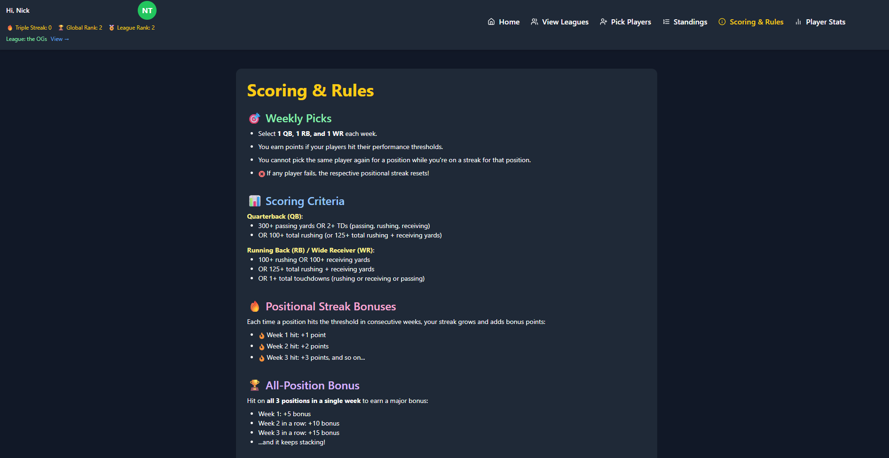
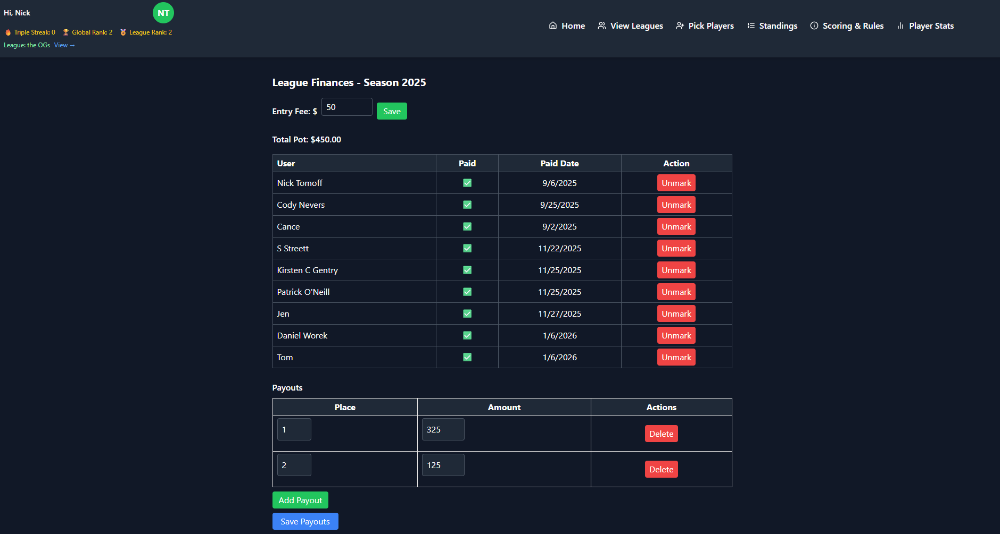

# Screenshots – Fantasy NFL Platform

This section provides a visual walkthrough of the Fantasy NFL platform’s
core user experiences. These screenshots are intended to demonstrate
application functionality, UX flow, and scoring visibility — not internal
implementation details.

The production application is actively developed and deployed; screenshots
may reflect in-progress UI iterations.

---

## Landing Page / Login & Sign-up Overview

**Purpose**
- Inviting page to a unique Fantasy game, TripleStreak!
- Serves as the landing page
- Provides Login & Sign-up capability

---

## Dashboard / League Overview

**Purpose**
- Displays league-level context
- Serves as the primary league navigation hub
- Interface for creating or joining leagues

---

## Weekly Picks Interface

**Purpose**
- Users submit weekly selections by position (QB, RB, WR)
- Interface enforces position constraints and submission flow
- Picks are scoped to league, week, and season

---

## Locked Player Controls

**Purpose**
- Demonstrates UX-level enforcement of game-time locking and positional streak rules
- Players with games already started cannot be selected
- Locking logic is enforced by backend validation

---

## Standings / Rankings

**Purpose**
- Displays league-level context and member standings
- Illustrates streak continuation and all-position bonus amplification
- Reflects cumulative scoring based on streak-amplified logic
- Shows sorted league standings based on total fantasy points
- Reflects finalized scoring results
- Demonstrates ordering stability after scoring runs
- Displays projected maximum possible points assuming perfect future weeks

---

## Scoring & Rules

**Purpose**
- Displays league-level scoring rules

---

## Player Stats

**Purpose**
- Serves as a player stats view visualization hub for the season
- Demonstrates global scope and not league context based

---

## League Admin - Finances

**Purpose**
- Allows league administrator to set donation totals to league entry
- Flexible and league context based reward output
- Tracking log for member entry
    
---

## Mobile View (Optional)

**Purpose**
- Confirms responsive layout and mobile usability
- Demonstrates parity between web and mobile UX where applicable

---

## Notes

- Screenshots are intentionally limited to user-facing functionality
- Backend services, scoring logic, and data models are documented separately
  in `/api_contracts`, `/architecture`, and `/sample_code`
- Proprietary logic and full source code are not included in this repository
